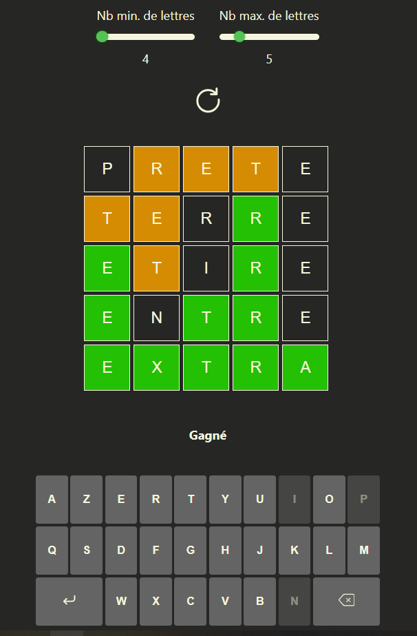
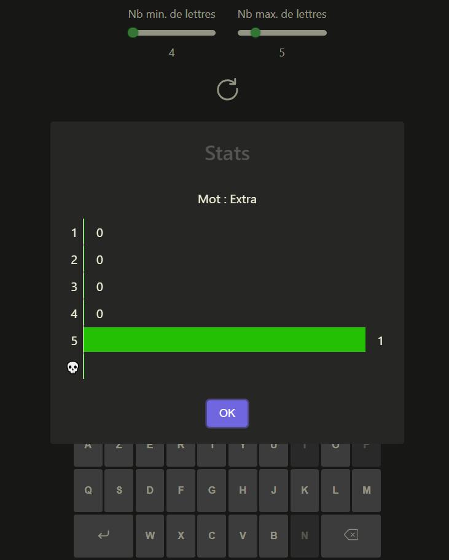

# React Wordle

My own Wordle game in React, including the possibility to set up the word length and start new games at will.

It's in french only, but it is possible to convert it to any other language following these steps : 
* You need to search the internet for at least one words list in your language, in the same format as /src/data/francais.txt
In option, as I did for a better user-friendly experience, I in fact searched for two lists : 
    - one with the most used words, for word generation,
    - one with the maximum amount of words possible, for selection validation.
The current code in App.js is oriented for this case, but I will detail how to update it to work with only one list.

* The /src/data/data.json contains the most used words in my case and are stored in a variable called wordsForGen in App.js
If you want the simplest version of a the game and use only one words list, you will work with this file only.
- To create it from the .txt words list, you can execute the python script /src/data/genWordsListToFind.py and replace "francais.txt" by your .txt file name.
- Once you have a data.json file, you will need to modify the App.js function genWordsData()
    Change the lines : 
        wordsForTest = []
		const importWords = async (number) => {
			const data = await require(`./data/francais_${number}.json`);
			wordsForTest = wordsForTest.concat(data)
		};
    By : 
    wordsForTest = wordsForGen

    It should make the deal by connecting the two variables into one.

* If you want the Find/Validate system like in the current code, generate the data.json with the most used words list (previous step), then:
-  Execute the genWordsListForValidation.py script on your exhaustive words list.
It will ask you for the wanted word length, execute it for each word length you want, in this example from 4 to 10.
- If you are a python connoisseur, it is surely possible to do it in one script, looping on the file and filling json files by word length. I'm open to suggestions.
- I choosed to split the exhausive words lists into smaller json files by length to load only the files the game need, because the most used words represent only ~10k words meanwhile the exhaustive list represents ~150k words.

* If you need to manually add words in a json file, just add the words to the end and execute the data_sort.py script after updated the json file name in the script.

* Change the labels and texts in the game (and the alphabet in the /src/components/Keybard.jsx) with your language equivalent

There you go !

## Installation

In the project directory, you can run:

### `npm install`

Install the need dependencies on your local machine. 

### `npm start`

Runs the app in the development mode.\
Open [http://localhost:3000](http://localhost:3000) to view it in your browser.

The page will reload when you make changes.\
You may also see any lint errors in the console.

### `npm run build`

Builds the app for production to the `build` folder.\
It correctly bundles React in production mode and optimizes the build for the best performance.

The build is minified and the filenames include the hashes.\
Your app is ready to be deployed!

See the section about [deployment](https://facebook.github.io/create-react-app/docs/deployment) for more information.

### Deployment

This app uses the react-github-pages library to host the production build.
Run `npm run deploy` once you modifications are committed/pushed to github.

## Previews

[Live page](https://tolexia.github.io/react-wordle/)